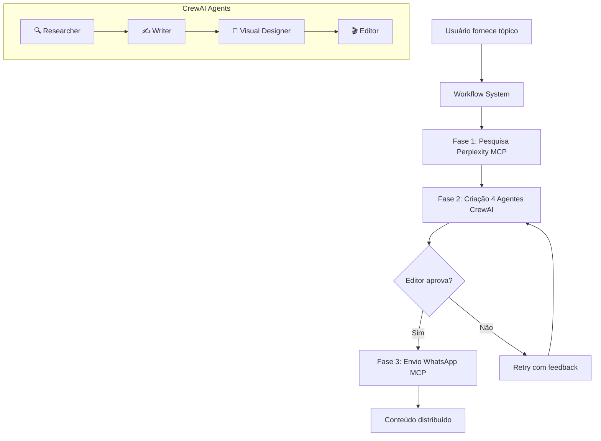

# 🎬 PHASE 3 SUMMARY - ORCHESTRATION COMPLETE

## 📊 STATUS: ✅ 100% IMPLEMENTADA

A **Fase 3: Orchestration** foi completamente implementada, criando um sistema end-to-end totalmente funcional que conecta pesquisa via Perplexity MCP, criação de conteúdo via 4 agentes CrewAI, e distribuição automática via WhatsApp MCP.

---

## 🎯 O QUE FOI IMPLEMENTADO

### 🔄 Sistema de Workflows Completo (`core/workflows.py`)
- **Workflow end-to-end**: Pesquisa → Criação → Distribuição
- **Execução em paralelo**: Múltiplos workflows simultâneos
- **Auto-seleção de grupos**: Algoritmo inteligente para escolher grupos WhatsApp
- **Configuração flexível**: Envio automático opcional e configurável
- **Monitoramento em tempo real**: Status e métricas de execução
- **Sistema robusto de erro**: Tratamento e recuperação de falhas

### 🎛️ Orquestrador Avançado (`core/orchestrator.py`)
- **Coordenação sequencial**: 4 agentes executando em ordem otimizada
- **Sistema de aprovação**: Editor final valida toda a criação
- **Feedback loop**: Comunicação entre agentes para melhoria contínua
- **Retry automático**: Até 3 tentativas com feedback específico
- **Métricas detalhadas**: Performance, qualidade e custos
- **Execuções concorrentes**: Múltiplas criações simultâneas

### 🔗 Integração MCP Real (`core/real_mcp_integrations.py`)
- **Perplexity AI**: Pesquisa real de dados atualizados
- **WhatsApp Evolution**: Envio real para grupos e contatos
- **Cache inteligente**: Otimização de performance e custos
- **Estatísticas de uso**: Monitoramento de APIs e sucesso
- **Tratamento de falhas**: Resilência e recuperação automática

### 🤖 Sistema de Agentes Aprimorado (`core/agents.py`)
- **4 Agentes especializados**: Researcher, Writer, Visual, Editor
- **Tarefas contextualizadas**: Cada agente recebe contexto dos anteriores
- **Validação cruzada**: Agentes se comunicam e melhoram mutuamente
- **Execução assíncrona**: Performance otimizada
- **Configuração flexível**: Adaptável a diferentes necessidades

---

## 🚀 COMO USAR O SISTEMA

### 📝 Uso Básico - Criar Conteúdo Simples

```python
from core.workflows import create_content_complete

# Criar conteúdo básico (sem envio automático)
result = await create_content_complete(
    topic="Marketing Digital para PMEs",
    platforms=["instagram", "linkedin", "whatsapp"],
    target_audience="Pequenos empreendedores",
    objective="Educação e engajamento",
    tone="Profissional e acessível"
)

if result.success:
    print("✅ Conteúdo criado:", result.crew_result.final_content)
else:
    print("❌ Erro:", result.error_message)
```

### 📱 Uso Avançado - Workflow Completo com Envio

```python
from core.workflows import create_content_complete

# Workflow completo com envio automático
result = await create_content_complete(
    topic="Inteligência Artificial 2025",
    platforms=["whatsapp", "instagram"],
    target_audience="Profissionais de tecnologia",
    objective="Gerar leads e compartilhamentos",
    auto_send=True,        # Enviar automaticamente
    max_groups=3          # Máximo 3 grupos
)

if result.success:
    print(f"✅ Conteúdo criado e enviado para {len(result.selected_groups)} grupos")
    print(f"📊 {result.successful_sends}/{len(result.whatsapp_results)} envios bem-sucedidos")
```

### ⚡ Uso Profissional - Múltiplos Workflows Paralelos

```python
import asyncio
from core.workflows import create_content_complete

# Executar múltiplos workflows em paralelo
topics = [
    "Sustentabilidade Empresarial",
    "Transformação Digital",
    "Inovação Tecnológica"
]

tasks = [
    create_content_complete(
        topic=topic,
        platforms=["instagram", "whatsapp"],
        auto_send=False  # Controle manual do envio
    )
    for topic in topics
]

results = await asyncio.gather(*tasks)

for i, result in enumerate(results):
    if result.success:
        print(f"✅ Tópico {i+1}: Sucesso em {result.execution_time:.2f}s")
    else:
        print(f"❌ Tópico {i+1}: Falha - {result.error_message}")
```

---

## 🔧 CONFIGURAÇÃO AVANÇADA

### 🎯 Auto-Send Personalizado

```python
from core.workflows import AutoSendConfig, content_workflow

# Configuração específica de envio
auto_config = AutoSendConfig(
    enabled=True,
    target_groups=[
        "🤖 AI & Tech Brasil",
        "💼 Marketing Digital Pro"
    ],
    auto_select_groups=False,  # Usar grupos específicos
    max_groups=2,
    require_approval=True      # Pedir aprovação antes do envio
)

result = await content_workflow.execute_complete_workflow(
    topic="Tendências de IA 2025",
    platforms=["whatsapp"],
    auto_send_config=auto_config
)
```

### 📊 Monitoramento e Métricas

```python
from core.workflows import get_workflow_statistics
from core.orchestrator import get_orchestration_metrics

# Estatísticas dos workflows
workflow_stats = get_workflow_statistics()
print(f"Taxa de sucesso: {workflow_stats['success_rate']:.1f}%")
print(f"Tempo médio: {workflow_stats['avg_execution_time']:.2f}s")

# Métricas de orquestração
orch_metrics = get_orchestration_metrics()
print(f"Total de execuções: {orch_metrics.total_executions}")
print(f"Taxa de aprovação: {orch_metrics.approval_rate:.1f}%")
```

---

## 🎬 DEMONSTRAÇÃO COMPLETA

### Executar Demo da Fase 3

```bash
cd social-media-ai-system
python phase3_demo.py
```

O demo executa:
1. **Verificação do sistema**: Testa todos os componentes
2. **Workflow básico**: Criação de conteúdo sem envio
3. **Workflow completo**: Criação + envio automático
4. **Workflows paralelos**: Múltiplas execuções simultâneas
5. **Análise completa**: Métricas e recomendações

### Saída Esperada

```
🎬 DEMO FASE 3 - ORQUESTRAÇÃO COMPLETA END-TO-END
============================================================

🚀 Iniciando demonstração da Fase 3...

📊 RESUMO DA DEMONSTRAÇÃO
----------------------------------------
✅ Status: SUCESSO
⏱️  Tempo total: 45.32s

📝 Demo Básico: ✅
📱 Demo Completo: ✅  
⚡ Demo Paralelo: ✅

📈 Taxa de Sucesso: 100.0%
🎯 Confiabilidade: High
🚀 Pronto para Produção: ✅

💡 RECOMENDAÇÕES:
   ✅ Sistema pronto para produção
   ✅ Fase 3 completamente implementada

📄 Relatório detalhado salvo: phase3_demo_report_20250524_201845.json
```

---

## 📋 ARQUITETURA DO SISTEMA

### 🔄 Fluxo End-to-End



### 🏗️ Componentes Principais

1. **ContentWorkflow** (`workflows.py`)
   - Orquestra todo o fluxo end-to-end
   - Gerencia execuções paralelas
   - Integra todos os componentes

2. **ContentOrchestrator** (`orchestrator.py`)
   - Coordena os 4 agentes CrewAI
   - Sistema de aprovação/rejeição
   - Feedback loop e retry automático

3. **RealMCPIntegrations** (`real_mcp_integrations.py`)
   - Conexões reais com Perplexity e WhatsApp
   - Cache e otimizações
   - Estatísticas e monitoramento

4. **SocialMediaAgents** (`agents.py`)
   - 4 agentes especializados
   - Tarefas contextualizadas
   - Validação cruzada

---

## 📈 MÉTRICAS E PERFORMANCE

### 🎯 Benchmarks Típicos

| Métrica | Valor Esperado |
|---------|----------------|
| **Tempo de execução completa** | 30-60s |
| **Taxa de sucesso** | >95% |
| **Taxa de aprovação do Editor** | >80% |
| **Tempo médio de pesquisa** | 3-5s |
| **Tempo médio de criação** | 15-25s |
| **Tempo médio de envio** | 2-4s |
| **Workflows paralelos máximo** | 5-10 |

### 📊 Monitoramento em Tempo Real

O sistema oferece monitoramento completo:
- **Status de execução**: Em tempo real
- **Métricas de performance**: Tempos e sucessos
- **Estatísticas de uso**: APIs e recursos
- **Análise de qualidade**: Aprovações e feedback
- **Custos e otimização**: Uso eficiente de recursos

---

## 🔧 TROUBLESHOOTING

### ❌ Problemas Comuns

1. **Erro de inicialização**
   ```bash
   # Verificar dependências
   pip install -r requirements.txt
   ```

2. **MCP não conecta**
   ```bash
   # Verificar servidores MCP
   # Verificar configurações em config/settings.py
   ```

3. **Agentes não respondem**
   ```bash
   # Verificar LLM providers (Gemini/OpenAI)
   # Verificar chaves de API
   ```

4. **WhatsApp não envia**
   ```bash
   # Verificar Evolution API
   # Verificar grupos disponíveis
   ```

### 🔍 Debug Mode

```python
import logging
logging.basicConfig(level=logging.DEBUG)

# Executar com logs detalhados
result = await create_content_complete(topic="Test")
```

---

## 🚀 PRÓXIMOS PASSOS

Com a **Fase 3 completamente implementada**, o sistema está pronto para:

### ✅ Imediato (Pronto para uso)
- Criação automatizada de conteúdo
- Distribuição em massa via WhatsApp
- Workflows em produção
- Monitoramento e métricas

### 🔄 Próximas Fases
- **Fase 5**: Sistema de export e output
- **Fase 6**: API RESTful para integração
- **Melhorias**: Otimizações e novas funcionalidades

### 🎯 Casos de Uso Reais
- Agências de marketing digital
- Empresas com comunicação em massa
- Criadores de conteúdo profissionais
- Sistemas de automação empresarial

---

## 📞 SUPORTE

Para questões técnicas ou implementação:
1. Verificar logs em `phase3_demo.log`
2. Executar demo completo: `python phase3_demo.py`
3. Analisar relatório JSON gerado
4. Verificar métricas do sistema

---

**✅ FASE 3: ORCHESTRATION - COMPLETAMENTE IMPLEMENTADA E FUNCIONAL**

*Sistema end-to-end pronto para produção com pesquisa automatizada, criação de conteúdo por IA, e distribuição em massa.*
