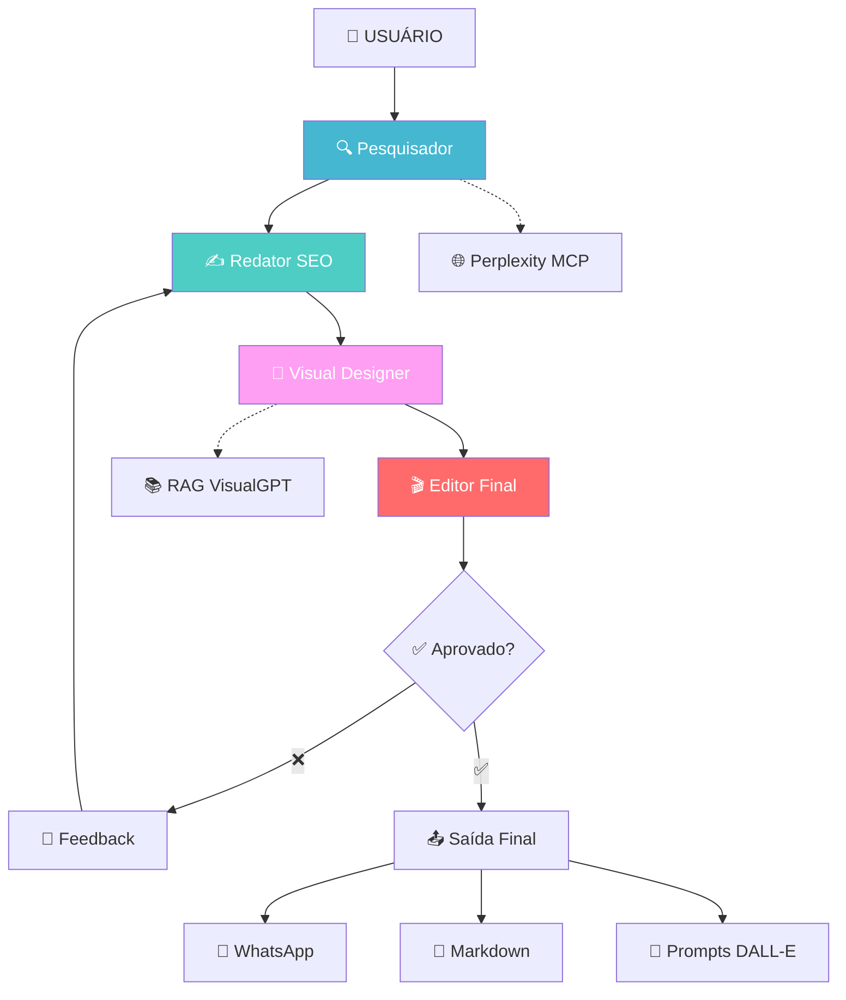

# 🚀 Social Media AI System

Sistema avançado de orquestração de agentes IA para criação de conteúdo profissional para redes sociais.

[](https://www.python.org/downloads/)
[](https://github.com/joaomdmoura/crewAI)
[](https://ai.google.dev/)
[](https://openai.com/)

## 🎯 O que é?

Um sistema que **recebe um tema** e **produz conteúdo profissional** para Instagram, WhatsApp e LinkedIn através de **4 agentes IA especializados** que trabalham em conjunto, com qualidade aprovada por um **editor IA rigoroso**.

### ✨ Principais Funcionalidades

- 🔍 **Pesquisa Automática**: Dados atualizados via Perplexity AI
- ✍️ **Conteúdo Otimizado**: Textos SEO para cada rede social
- 🎨 **Prompts Visuais**: Geração automática baseada no manual VisualGPT
- 🎬 **Controle de Qualidade**: Editor IA aprova/rejeita conteúdo
- 📱 **Envio Direto**: WhatsApp automático via Evolution API
- 💾 **Exportação MD**: Arquivos organizados prontos para uso

## 🏗️ Arquitetura



## 🎭 Os 4 Agentes

| Agente | LLM | Função | Especialidade |
|--------|-----|--------|---------------|
| 🔍 **Pesquisador** | Gemini Flash | Coleta dados atualizados | Perplexity AI, tendências |
| ✍️ **Redator SEO** | Gemini Flash | Cria textos otimizados | Copywriting, hashtags |
| 🎨 **Visual Designer** | GPT-4o-mini | Gera prompts visuais | RAG VisualGPT, DALL-E |
| 🎬 **Editor Final** | GPT-4o-mini | Aprova/rejeita conteúdo | Quality assurance |

## 🚀 Quick Start

### 1. Instalação

```bash
# Clone o repositório
git clone <repo-url>
cd social-media-ai-system

# Instale dependências
pip install -r requirements.txt
```

### 2. Configuração

```bash
# Copie e configure as variáveis de ambiente
cp .env.example .env

# Edite o arquivo .env com suas chaves de API
nano .env
```

### 3. Chaves de API Necessárias

```bash
# .env
GOOGLE_API_KEY=sua_chave_gemini_aqui
OPENAI_API_KEY=sua_chave_openai_aqui

# Opcionais (para MCP)
PERPLEXITY_API_KEY=sua_chave_perplexity
EVOLUTION_API_URL=sua_url_evolution
EVOLUTION_API_KEY=sua_chave_evolution
```

### 4. Execução

```bash
# Execute o sistema principal
python main.py
```

## 📁 Estrutura do Projeto

```
social-media-ai-system/
├── 📋 DEVELOPMENT_ROADMAP.md      # Roadmap de desenvolvimento
├── 🎯 PROJECT_CONTEXT.md          # Contexto e objetivos
├── 📖 README.md                   # Esta documentação
├── 🔧 requirements.txt            # Dependências
├── 🔐 .env                        # Variáveis de ambiente
│
├── 📁 core/                       # Núcleo do sistema
│   ├── 🤖 agents.py               # Definição dos agentes
│   ├── 🧠 llm_manager.py          # Gerenciador de LLMs
│   ├── 🎨 visual_prompt_engine.py # Engine RAG visual
│   ├── 🔗 mcp_integrations.py     # Integrações MCP
│   └── 📊 orchestrator.py         # Orquestrador principal
│
├── 📁 data/                       # Dados e recursos
│   ├── 📚 visual_gpt.pdf          # Base conhecimento RAG
│   └── 🗃️ embeddings/             # Embeddings gerados
│
├── 📁 output/                     # Saídas geradas
│   ├── 📱 content/                # Conteúdos por plataforma
│   ├── 🎨 prompts/                # Prompts visuais
│   └── 📊 analytics/              # Métricas
│
└── 🚀 main.py                     # Ponto de entrada
```

## 💡 Exemplo de Uso

### Input
```
Tema: "Inteligência Artificial em Marketing 2025"
```

### Output Automático

#### 📱 Instagram
```markdown
🤖 A revolução da IA no marketing está apenas começando!

✨ Principais tendências 2025:
• Personalização em tempo real
• Chatbots ultra-inteligentes  
• Análise preditiva de comportamento
• Automação criativa

💡 Empresas que adotarem essas tecnologias terão 300% mais ROI!

👇 Qual dessas tendências mais te impressiona?

#IAMarketing #MarketingDigital #IA2025 #Inovacao #TechTrends
```

#### 🎨 Prompt Visual (Instagram)
```
Crie um infográfico visual e ilustrado com 4 blocos, no estilo flat colorido moderno.
Tema: Tendências de IA em Marketing 2025
Formato: vertical 1080x1350 (Instagram)
Público-alvo: profissionais de marketing
Paleta de cores: azul, roxo e branco
Cada bloco deve ter ícone, título e texto explicativo breve
Estilo: clean, profissional, tech-friendly
```

#### 💬 WhatsApp
```
🤖 Galera, vocês viram o que está rolando com IA no marketing?

Os números são impressionantes:
• 300% de aumento no ROI
• 67% das empresas já usam IA
• Personalização em tempo real virando padrão

🚀 Quem não se adaptar vai ficar para trás...

Vale muito a pena estudar sobre isso! 📚
```

#### 💼 LinkedIn
```
A Inteligência Artificial está redefinindo o marketing digital.

Dados recentes mostram crescimento de 400% no uso de IA para personalização. 
Empresas líderes já implementam:

→ Análise preditiva de comportamento
→ Automação criativa de campanhas  
→ Chatbots com processamento natural

A pergunta não é mais "se" usar IA, mas "como" implementar estrategicamente.

Qual tem sido sua experiência com IA em marketing?

#InteligenciaArtificial #MarketingDigital #Inovacao
```

## 🔧 Configuração Avançada

### MCP Tools

O sistema integra com ferramentas MCP para funcionalidades avançadas:

- **Perplexity**: Pesquisa de dados atualizados
- **WhatsApp Evolution**: Envio automático de mensagens

### RAG Visual

Sistema de recuperação baseado no manual VisualGPT:

- **PDF Processado**: Embeddings do manual completo
- **Busca Semântica**: Encontra técnicas relevantes
- **Prompts Otimizados**: Geração automática por plataforma

## 📊 Status do Desenvolvimento

### ✅ Concluído
- [x] Estrutura de pastas organizada
- [x] Documentação completa
- [x] Roadmap detalhado

### 🔄 Em Desenvolvimento
- [ ] **Fase 1**: Configuração LLMs e agentes base
- [ ] **Fase 2**: Sistema RAG visual
- [ ] **Fase 3**: Orquestração CrewAI

### 📋 Próximas Fases
- [ ] **Fase 4**: Integração MCP completa
- [ ] **Fase 5**: Exportação e analytics
- [ ] **Fase 6**: API para front-end

## 🤝 Como Contribuir

1. **Fork** o projeto
2. **Crie uma branch** para sua feature (`git checkout -b feature/AmazingFeature`)
3. **Commit** suas mudanças (`git commit -m 'Add some AmazingFeature'`)
4. **Push** para a branch (`git push origin feature/AmazingFeature`)
5. **Abra um Pull Request**

## 📄 Licença

Este projeto está sob a licença MIT. Veja o arquivo `LICENSE` para mais detalhes.

## 🆘 Suporte

### 📚 Documentação
- [Roadmap de Desenvolvimento](DEVELOPMENT_ROADMAP.md)
- [Contexto do Projeto](PROJECT_CONTEXT.md)

### 🐛 Issues
Encontrou um bug? [Abra uma issue](../../issues)

### 💬 Discussões
Dúvidas ou sugestões? [Inicie uma discussão](../../discussions)

## 🙏 Agradecimentos

- **CrewAI**: Framework de orquestração de agentes
- **Google Gemini**: LLM gratuita para pesquisa e redação
- **OpenAI**: GPT-4o-mini para qualidade premium
- **Perplexity AI**: Pesquisa de dados atualizados
- **Evolution API**: Integração WhatsApp Business
- **Miau Studio 7**: Manual VisualGPT

---

**Made with ❤️ and 🤖 AI**

*Sistema desenvolvido para democratizar a criação de conteúdo profissional através de inteligência artificial avançada.*
